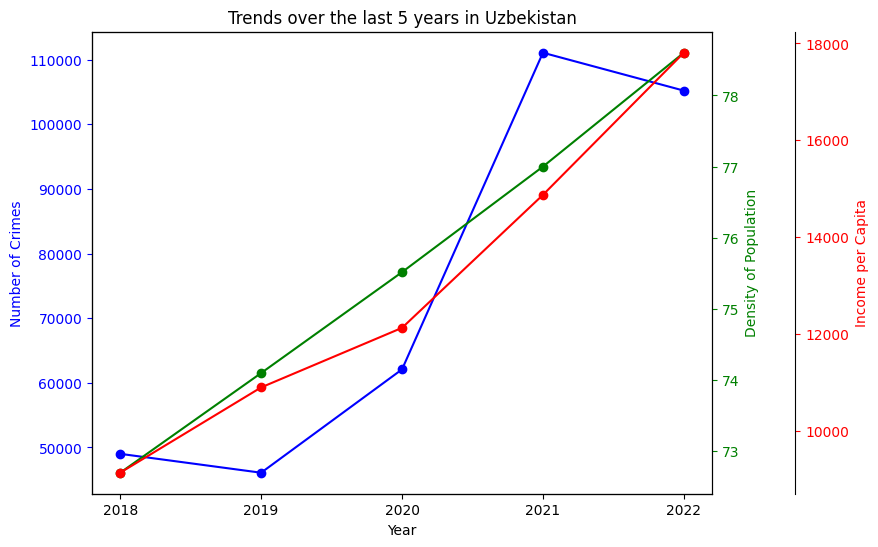
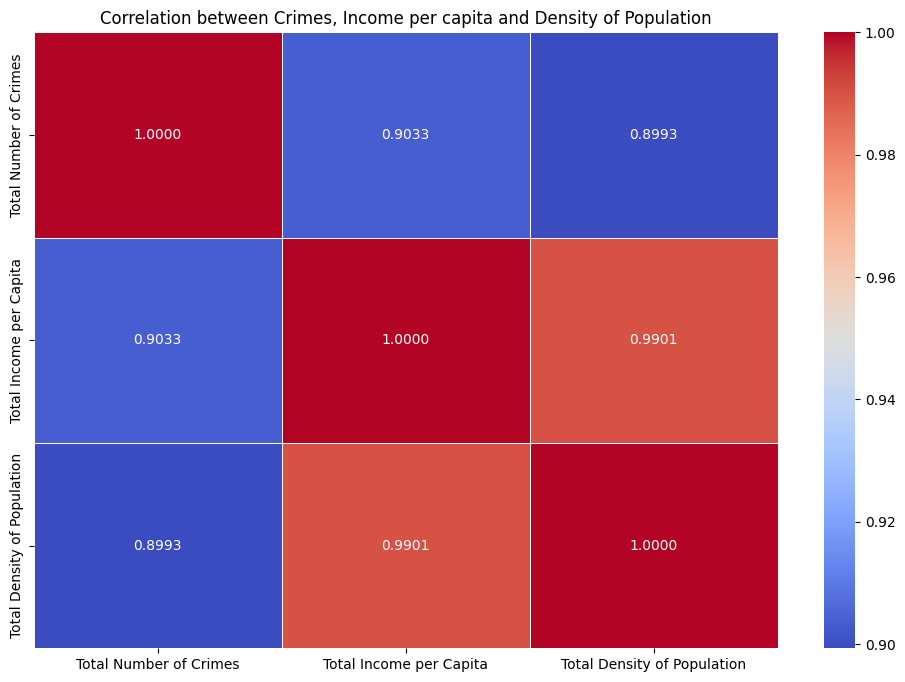
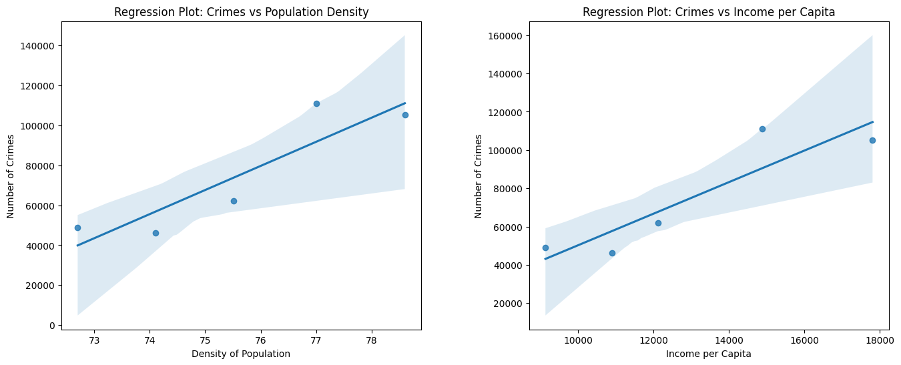

# Analyzing Crime Rates in Uzbekistan: A Demographic Perspective

This project's goal is to analyze the dynamics of crime rates in Uzbekistan by integrating crime statistics with demographic data, including population density and income levels.

We aim to identify potential correlations and causalities between these variables.

**Go to the [project/report.ipynb](https://github.com/Ozodbek47/DataEngineering/blob/main/project/report.ipynb) for the main code and more information.**

**You can find the presentation slides of the project at [project/slides.pdf](https://github.com/Ozodbek47/DataEngineering/blob/main/project/slides.pdf)**

**Presentation video of the project is available at [project/presentation-video.mp4](https://github.com/Ozodbek47/DataEngineering/blob/main/project/presentation-video.mp4)**

#### To download, preprocess and store the necessary datasets from stat.uz in the `data` folder, run:

```bash
python3 project/pipeline.py
```

### Sample results of data analysis

Trends Graph:
<br><br>

<br><br>
Correlation Matrix: 
<br><br>

<br><br>
Regression Plots:
<br><br>


#### Context
This project was done during the 'Methods of Advanced Data Engineering' course provided by the [Professorship for Open-Source Software](https://oss.cs.fau.de) at Friedrich-Alexander University Erlangen-Nürnberg.